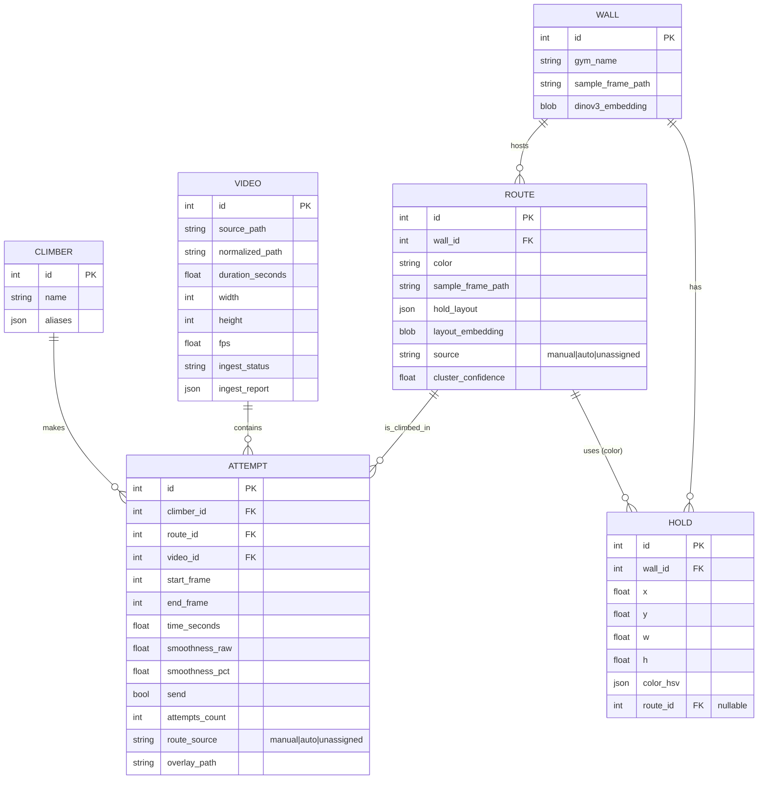

# Strava-for-climbing video pipeline + leaderboard demo

## Enhancement Summary

**Deepened:** 2026-05-28 (same day, post `/workflows:plan`).
**Reviewers consulted:** architecture-strategist, code-simplicity-reviewer, performance-oracle, data-integrity-guardian, kieran-python-reviewer, pattern-recognition-specialist, Context7 API verification (ultralytics, transformers, supervision, streamlit), ffmpeg ingest researcher.

### Day-0 decisions surfaced (team must vote)

1. **Whether to keep Stage 2 at all.** Simplicity reviewer recommends cutting it entirely — 50% of plan, ~0% of demo's emotional payload. See Addendum §A.
2. **Smoothness percentile UX:** recompute-on-every-run (current default, silently shifts old scores) vs. **frozen baseline** (recommended Strava-like UX). See Addendum §C.
3. **Adopt the concrete DDL** (with CHECK constraints, FK on-delete, indexes, and a TRIGGER that enforces the manual-route invariant at the DB level — not just application code). See Addendum §B.

### Verified additions (no decision needed)

- ✅ ffmpeg command updated for 2026 (`-fps_mode cfr` replaces deprecated `-vsync cfr`), HDR10 tone-mapping branch, source-SHA-256 dedup, full ffprobe parser. Addendum §D.
- ✅ Performance swaps: **YOLO11x → YOLO11l-pose** (~2× faster), **DINOv3 ViT-L → ViT-S** (~10× fewer params), 720p downsample at ingest, **NVENC** for overlay encoding. Addendum §E.
- ✅ Module collapse: 17 → ~10. Fold `track_selection` into `pose`, merge `frames` into `ingest`, group `holds/color_cluster/wall_embed/route_match` under `routes/` subpackage. Rename `process.py` → `orchestrate.py`, `models.py` → `schema.py` (collision with `models/` weights dir). Addendum §F.
- ✅ Stage 2 isolation: lazy imports, `STRAVA_CLIMBING_DISABLE_STAGE2=1` env flag, explicit `Stage` Protocol + per-stage manifest scheme. Addendum §G.
- ✅ DB pragmas: `foreign_keys=ON`, `journal_mode=WAL`, `busy_timeout=5000` on every connection; demo mode uses `?mode=ro`. Addendum §B.
- ✅ Verified 2026 import snippets for ultralytics, Grounding DINO, SAM 2, DINOv3, supervision, streamlit. Addendum §H.
- ✅ Streamlit query cache (`@st.cache_data` in `apps/streamlit/queries.py`); never `sqlite3.connect()` from a page. Addendum §G.
- ✅ `RouteSource` `StrEnum` replaces stringly-typed `"manual|auto|unassigned"`; centralize state-machine in `provenance.py`. Addendum §F.
- ✅ Typer for CLI; plain `@dataclass` + raw `sqlite3` (skip SQLModel/Pydantic); drop `mypy --strict`. Addendum §F.

The original plan below is **preserved verbatim**. See **Deepened Plan Addendum** at end of file for full synthesized findings.

## Overview

Build a demo-grade Python pipeline that turns raw bouldering videos into a **per-route leaderboard** with per-attempt performance metrics, presented through a Streamlit web UI. Scope is a curated subset of the team's video dataset (3–5 routes, ~10–20 clips). Approach is staged: a **pose-first MVP** ships by end of day 2 (Stage 1) so we always have something to demo, and **hold detection + automatic route matching** layers on in days 3–4 (Stage 2). All inference uses pretrained open-source models; no training from scratch.

## Problem Statement

The team owns a corpus of bouldering training videos but nothing labeled. There is no system today for:

1. Identifying which **route** is being climbed in a given video.
2. Detecting **attempt boundaries** (start, top-out, fall, rest).
3. Computing **comparable performance metrics** across attempts on the same route.
4. **Visualizing and ranking** climbers per route in a Strava-style leaderboard.

A judge watching the demo should grasp the value in 60 seconds: pick a route, see who climbed it fastest and most smoothly, click an attempt, watch the climber with skeleton + center-of-mass path overlay, optionally compare two attempts side-by-side.

## Proposed Solution

Two parallel pipelines, joined at the leaderboard:

- **Pose pipeline** — `ffmpeg` ingest → `YOLO11x-pose` + `BoT-SORT` → per-frame keypoints + climber track → attempt boundaries → metrics (time-to-top, smoothness, send/fail). Always-on.
- **Wall/route pipeline (Stage 2)** — first stable pre-climb frame → fine-tuned `YOLOv8` hold detector (Roboflow `isira/climbing-holds-detection-n7bmb`) → `SAM 2.1` mask refinement → HSV color clustering per hold → wall descriptor (hold positions + color histogram + `DINOv3` patch features) → cluster videos by descriptor cosine similarity → assign route IDs to attempts that came in unlabeled. Stage 1 attempts retain their manually-tagged `route_id` and are never overwritten.

UI is a `Streamlit` app reading a `SQLite` database with **pre-rendered MP4 overlays** for every attempt so demo-day inference is zero.

## Technical Approach

### Architecture

```
┌────────────┐   ┌──────────────────┐   ┌───────────────────┐
│ data/raw/  │ → │ ingest (ffmpeg)  │ → │ data/normalized/  │
└────────────┘   └──────────────────┘   └────────┬──────────┘
                                                 │
                            ┌────────────────────┴────────────────────┐
                            ▼                                         ▼
                ┌───────────────────────┐                ┌──────────────────────┐
                │ pose pipeline         │                │ wall pipeline (S2)   │
                │ YOLO11x-pose +        │                │ pre-climb frame      │
                │ BoT-SORT              │                │ → YOLOv8 holds       │
                │ → keypoint trajectory │                │ → SAM 2.1 masks      │
                │ → attempt boundaries  │                │ → HSV color cluster  │
                │ → metrics             │                │ → DINOv3 wall embed  │
                │ → overlays (mp4)      │                │ → route descriptor   │
                └───────────┬───────────┘                │ → cosine clustering  │
                            │                            └──────────┬───────────┘
                            ▼                                       │
                ┌────────────────────────┐                          │
                │ SQLite (climbing.db)   │ ◀────────────────────────┘
                │ Climber/Video/Wall/    │
                │ Route/Attempt/Hold     │
                └───────────┬────────────┘
                            ▼
                ┌────────────────────────┐
                │ Streamlit app          │
                │ - dashboard            │
                │ - route leaderboard    │
                │ - attempt detail       │
                │ - compare (2-up)       │
                │ - label_climbers page  │
                │ - route_review page    │
                └────────────────────────┘
```

### Data Model (ERD)



### Pinned Definitions (resolves SpecFlow ambiguities)

These are the **defaults** for day-1 code. The team can override on Day 0 by edit-replacing constants in `strava_climbing/config.py`.

| Concept | Default rule | Where defined |
|---|---|---|
| **Attempt start** | Both ankle keypoints `y` above the lowest detected hold (or, Stage 1 fallback, above 80% of frame height) for ≥5 consecutive frames. | `boundary_detection.detect_start` |
| **Top reached** | Wrist keypoint within 1.5× torso-length of the highest detected hold for ≥10 consecutive frames. Stage 1 fallback: wrist y in top 10% of frame for ≥10 frames. | `boundary_detection.detect_top` |
| **Time-to-top** | (top_frame − start_frame) / fps. | `metrics.time_to_top` |
| **Smoothness (raw)** | Mean magnitude of jerk (3rd derivative) of estimated CoM trajectory over the attempt. | `metrics.smoothness_raw` |
| **Smoothness (display)** | Per-route percentile rank, mapped to 0–100 (higher = smoother). | `metrics.smoothness_pct` |
| **Send / fail** | `send=True` iff top reached AND wrist held in top region ≥2 s AND no rest event in last 5 s before top. | `metrics.classify_send` |
| **Rest event** | CoM stationary (<5 px movement window) for ≥3 s AND below 30% of frame height. | `boundary_detection.detect_rest` |
| **Fall–resume → two attempts** | If a rest event ≥5 s occurs between two on-wall segments, emit two `Attempt` rows sharing the same `video_id`. | `boundary_detection.split_on_rest` |
| **Multi-person disambiguation** | Choose the track with the largest cumulative vertical climb (max_y − min_y of CoM). Break ties by track duration. | `track_selection.pick_climber_track` |
| **Route cluster confidence** | Display a Stage-2 auto route only if mean intra-cluster cosine ≥ 0.85 on the combined descriptor. | `route_match.cluster_routes` |
| **Manual vs auto provenance** | `route_source ∈ {manual, auto, unassigned}`. Stage 2 **never overwrites** `manual`. Disagreement surfaces in `route_review` page. | `db.py`, `route_match.merge_assignments` |

### Project Structure

```
strava_for_climbing/
├── README.md
├── pyproject.toml                    # uv-managed
├── .env.example
├── data/
│   ├── raw/                          # team's source videos
│   ├── normalized/                   # ffmpeg-transcoded H.264 CFR
│   ├── overlays/                     # pre-rendered skeleton MP4s
│   ├── frames/                       # extracted keyframes (cache)
│   ├── ingest_report.json
│   └── climbing.sqlite
├── models/                           # cached weights (gitignored)
│   ├── yolo11x-pose.pt
│   ├── holds_yolov8m.pt              # fine-tuned from Roboflow
│   ├── sam2.1_hiera_small.pt
│   └── dinov3_vitl/
├── src/strava_climbing/
│   ├── __init__.py
│   ├── config.py                     # all tunable constants
│   ├── db.py                         # SQLite schema + helpers
│   ├── models.py                     # dataclasses
│   ├── ingest.py                     # ffmpeg normalize + EXIF
│   ├── frames.py                     # frame sampler + caching
│   ├── pose.py                       # YOLO + BoT-SORT
│   ├── track_selection.py            # pick climber track
│   ├── boundary_detection.py         # start / top / rest / split
│   ├── metrics.py                    # time, smoothness, send
│   ├── overlay.py                    # render MP4 with skeleton + CoM
│   ├── holds.py                      # YOLO holds + SAM 2.1
│   ├── color_cluster.py              # HSV per-hold + route color
│   ├── wall_embed.py                 # DINOv3 wall descriptor
│   ├── route_match.py                # descriptor + clustering
│   ├── process.py                    # top-level orchestration
│   └── cli.py                        # `ingest`, `process`, `demo`
├── apps/streamlit/
│   ├── main.py                       # dashboard + leaderboard
│   ├── pages/
│   │   ├── attempt_detail.py
│   │   ├── compare.py
│   │   ├── label_climbers.py
│   │   ├── route_review.py
│   │   └── ingest_health.py
│   └── components/                   # reusable widgets
├── notebooks/
│   ├── 00_dataset_audit.ipynb
│   ├── 01_pose_overlay_sandbox.ipynb
│   ├── 02_hold_zero_shot.ipynb
│   └── 03_route_clustering.ipynb
├── tests/
│   ├── test_boundary_detection.py
│   ├── test_metrics.py
│   ├── test_track_selection.py
│   ├── test_route_match.py
│   └── fixtures/                     # tiny synthetic videos
└── docs/
    ├── brainstorms/2026-05-28-strava-for-bouldering-brainstorm.md
    └── plans/2026-05-28-feat-strava-for-climbing-pipeline-plan.md
```

### Implementation Phases

#### Phase 0 — Day 0: dataset audit + scaffolding (half day)

**Deliverables**
- `notebooks/00_dataset_audit.ipynb` cataloging all source videos: resolution, codec, fps, duration, gym, count of climbers visible, camera-motion bucket (fixed / handheld / moving).
- Curated subset list committed to `data/curated_subset.csv`: target 10–20 videos across 3–5 routes, optimizing for fixed-camera, single-climber, clean top-out.
- Repo scaffolded with `pyproject.toml`, `uv` lockfile, the directory tree above, empty modules with type stubs.
- `db.py` schema migration (single `CREATE TABLE` script) committed and runnable.

**Success criteria**
- `uv sync` works on every team member's laptop.
- `python -m strava_climbing.cli ingest --dry-run data/raw/` lists videos with parsed metadata.
- All Day-0 questions in the SpecFlow review answered and pinned into `config.py`.

**Owner suggestion:** one person on audit + curation, one on scaffolding + DB, two on getting pose inference running on a sample clip (see Phase 1.1).

#### Phase 1 — Days 1–2: pose-first MVP (always-demoable)

**1.1 Ingest (`ingest.py`)**
- For each file in `data/raw/`, run ffmpeg: `-c:v libx264 -pix_fmt yuv420p -vsync cfr -r 30 -movflags +faststart -autorotate`.
- Reject videos <5 s. Auto-trim videos >5 min to the first detected on-wall segment.
- Parse EXIF for capture time, orientation. Hash `sha256` of normalized file for dedupe.
- Append a per-video record to `data/ingest_report.json` with status and any issues.
- Acceptance: idempotent (re-run only processes new files); rejection reasons are explicit.

**1.2 Pose + tracking (`pose.py`)**
- `Ultralytics` `YOLO('yolo11x-pose.pt').track(source=..., tracker='botsort.yaml', persist=True, conf=0.35, iou=0.5)`.
- Persist keypoints + track IDs per frame as compressed `numpy.savez` per video (`data/cache/pose/{video_id}.npz`).
- Apply **test-time rotation augmentation** for top 3 frames per attempt: run inference at 0/90/180/270, pick the skeleton with lowest mean keypoint variance (mitigation for inverted poses).

**1.3 Track selection + boundaries (`track_selection.py`, `boundary_detection.py`)**
- `pick_climber_track(npz)` returns the climber track ID using the rule pinned above.
- `detect_start`, `detect_top`, `detect_rest`, `split_on_rest` implement the pinned definitions and return `[Attempt(start_frame, end_frame), ...]`.

**1.4 Metrics (`metrics.py`)**
- CoM = weighted mean of relevant keypoints using approximate anthropometric weights (Winter 1990 values, hardcoded constant).
- `time_to_top`, `smoothness_raw` (mean |jerk|), `attempts_count`, `send` per pinned rules.
- Percentile-normalize smoothness per route at the end of processing (`metrics.finalize_smoothness_pct`).

**1.5 Overlay rendering (`overlay.py`)**
- Use `supervision` (`sv.EdgeAnnotator`, `sv.VertexAnnotator`, `sv.TraceAnnotator`) to render per-attempt MP4: skeleton + CoM trail + metric HUD.
- Write to `data/overlays/{attempt_id}.mp4`. Streamlit will only ever `st.video()` these files.

**1.6 Database + Streamlit MVP (`db.py`, `apps/streamlit/main.py`)**
- `db.upsert_attempt(...)`, `db.upsert_climber(...)`.
- Routes for Stage 1 are populated from a hand-edited `data/curated_subset.csv` with columns `video_filename, climber_name, route_name, gym, color`. Set `route_source='manual'`.
- Streamlit `main.py` shows route cards. Click → leaderboard page with one row per attempt.
- `pages/attempt_detail.py` shows video, metric breakdown, "Send" badge.
- `pages/compare.py` accepts two attempt IDs via query string and shows them side-by-side.

**1.7 Climber labeling (`pages/label_climbers.py`)**
- For attempts where `climber_id` is unset, show a thumbnail + dropdown of existing climbers + "Add new" inline form. Writes to DB.
- Used in dev only; not needed for judges.

**Phase 1 acceptance criteria**
- [ ] `python -m strava_climbing.cli process --stage pose` runs end-to-end on the curated subset without errors.
- [ ] Every attempt has a rendered overlay MP4 and a row in `attempts`.
- [ ] Streamlit dashboard lists ≥3 routes with ≥2 attempts each.
- [ ] Clicking a route opens a leaderboard ordered by `(send DESC, time_seconds ASC)`.
- [ ] Compare view plays two videos at synchronized playback.
- [ ] Hand-tested: at least one attempt with pose-tracking failure shows the "pose unavailable" badge and still plays the raw video.
- [ ] **By EOD Day 2 the demo is shippable even if Stage 2 never lands.**

#### Phase 2 — Days 3–4: hold detection + auto route matching

**2.1 Pre-climb frame selection (`frames.py:select_layout_frame`)**
- For each video, take the first frame **before** `attempt_start` where no person is detected by YOLO11x-pose. If none exists, mask the climber out of the median frame using SAM 2.1 on the pose-bbox, then inpaint with OpenCV `cv2.inpaint` (Telea).

**2.2 Hold detection (`holds.py`)**
- Fine-tune `yolov8m` (or `yolo11m`) on a merged Roboflow dataset (`isira/climbing-holds-detection-n7bmb` as the primary). Budget: 15-min fine-tune at 640² on a single GPU.
- Optionally refine bounding boxes into masks with SAM 2.1 (`Sam2Processor` + `input_boxes`) to get tight color sampling regions.

**2.3 Per-hold color (`color_cluster.py`)**
- Sample pixels inside each hold mask (or bbox interior, shrunk by 20%).
- Convert to HSV; k-means on `(h, s)` with k chosen by elbow on inertia, capped at 6 (typical gym uses few route colors). Assign each hold to the nearest centroid.
- Centroids → route color labels.

**2.4 Wall descriptor (`wall_embed.py`)**
- For each pre-climb frame:
  - **Layout vector**: list of (normalized_x, normalized_y, hue_bin) per hold, sorted by `(y desc, x)`. Padded to fixed length, hashed for quick lookup.
  - **Visual vector**: DINOv3 ViT-L CLS embedding of the wall crop (background mode). License-check: prefer a checkpoint published as Apache-2.0; fall back to DINOv2 ViT-L if licensing blocks.
  - Concatenate, L2-normalize.

**2.5 Route clustering (`route_match.py`)**
- Compute pairwise cosine similarity across all pre-climb frames in the dataset.
- Cluster with `sklearn.cluster.AgglomerativeClustering(distance_threshold=1-0.85, linkage='average')`.
- For each cluster: derive a canonical `Route` (centroid descriptor, dominant color, sample frame).
- `merge_assignments(manual, auto)`: for each attempt, keep `manual` if present; else set `route_source='auto'` with the new `route_id`. Surface disagreements in `pages/route_review.py`.

**2.6 Route review UI (`pages/route_review.py`)**
- Show cluster suggestions with member thumbnails. Operator can `Accept` (writes auto route), `Reject` (marks unassigned), or `Merge into manual route X`.

**Phase 2 acceptance criteria**
- [ ] Stage-2 process command `process --stage walls` runs on all videos without error (allowed: per-video skips with logged reasons).
- [ ] ≥80% of curated videos have a hold count within ±20% of ground-truth (eyeballed) on the audit subset.
- [ ] Auto-clustered routes show in dashboard with an "auto" badge and `cluster_confidence ≥ 0.85`.
- [ ] At least one originally-unassigned attempt gets auto-assigned to a route and appears in the leaderboard.
- [ ] Stage-1 demo path is **untouched** — disabling Stage 2 via env var falls back cleanly.

## Alternative Approaches Considered

| Approach | Why we rejected (for hackathon) |
|---|---|
| **Pose-only (Approach A)** | Honors the simpler shipping plan but doesn't satisfy the team's stated interest in auto-route-matching, and routes feel artificial when judges have to read a CSV column. |
| **VLM-as-primary (Approach C)** | Qwen3-VL / Gemini Flash can extract `{topped_out, route, outcome}` from frames, but numeric metrics (time, smoothness) become unreliable and route matching turns into a hand-wavy "the model said so." Kept as an optional sanity-check oracle in Phase 2.7 (out-of-scope unless time permits). |
| **Zero-shot Grounding DINO for holds** | Works for macro holds but misses tiny chips and confuses route tape for holds. Fine-tuning YOLO on the Roboflow dataset is a ~15-min cost for much better accuracy and a 10× speed-up at inference. |
| **Sapiens v1 / Sapiens2 for pose** | Higher-quality keypoints but Sapiens v1 is CC-BY-NC; Sapiens2 license is fresh and ambiguous. AGPL-3.0 from Ultralytics is acceptable for a hackathon submission; non-commercial licenses are not. |
| **DINOv3 vs DINOv2 for embeddings** | DINOv3 (Aug 2025) is SOTA but some checkpoints are non-commercial. Use the most permissive DINOv3 size we can find; fall back to DINOv2 ViT-L (Apache-2.0). |
| **Real-time / live capture** | Out of scope. Live capture from a webcam introduces wifi, lighting, and codec risk on stage. Pre-recorded videos only. |

## Acceptance Criteria

### Functional Requirements

- [ ] Idempotent `ingest` normalizes raw videos and produces a JSON ingest report.
- [ ] `process --stage pose` populates `attempts` rows for every successfully ingested video with at least one detected on-wall segment.
- [ ] Every attempt has a rendered overlay MP4 in `data/overlays/`.
- [ ] Streamlit dashboard lists routes ordered by attempt count; opens to leaderboard sorted by `(send DESC, time_seconds ASC)`.
- [ ] Attempt-detail page plays the overlay and shows time, smoothness percentile, send/fail.
- [ ] Compare page shows two attempts side-by-side with synchronized playback.
- [ ] (Stage 2) `process --stage walls` produces hold detections, route clusters, and updates attempts with `auto` route assignments where appropriate, never overwriting `manual`.
- [ ] Route-review page lets a human accept/reject/merge auto cluster suggestions.

### Non-Functional Requirements

- [ ] Demo runs **fully offline** on the demo laptop — no network calls, all weights pre-downloaded to `models/`.
- [ ] CPU fallback path: Stage 1 pipeline completes (slowly) without a GPU. Stage 2 may require GPU and degrade gracefully if unavailable.
- [ ] Pipeline is restartable: failure on one video logs to `ingest_report.json` and continues.
- [ ] No `st.video()` call ever triggers model inference; overlays are pre-rendered.
- [ ] Total dependencies installable via `uv sync` in <90 s on a warm cache.

### Quality Gates

- [ ] `pytest tests/` green for `metrics.py`, `boundary_detection.py`, `track_selection.py`, `route_match.py` with synthetic-keypoint fixtures.
- [ ] At least one end-to-end test that runs the full pipeline on a 5-second fixture video and asserts a non-empty `attempts` row.
- [ ] `ruff` + `mypy --strict` clean on the `src/strava_climbing/` package.
- [ ] README documents how to reproduce the demo on a clean machine (clone, `uv sync`, fetch a small public sample video, `cli process`, `streamlit run`).

## Success Metrics

| Metric | Target |
|---|---|
| Routes with ≥2 attempts in the leaderboard at demo time | ≥3 |
| End-to-end processing time on curated subset (single A10G/4090 or M-series GPU) | ≤20 minutes |
| Pose-tracking success rate (visually correct skeletons on ≥50% of attempt frames) | ≥70% of curated attempts |
| Auto-clustered routes matching manual ground truth (Stage 2) | ≥80% on curated subset |
| Streamlit page load time after pipeline run | <2 s per page |
| Demo can run with **zero internet** | Required |

## Dependencies & Prerequisites

**Software**
- Python 3.12+, `uv` for env management.
- System: `ffmpeg` ≥6.0, `git lfs` (for model weights if we vendor them).
- GPU: NVIDIA with ≥12 GB VRAM recommended (RTX 4070+); Apple Silicon (`mps`) acceptable for Stage 1. Plan declares one team-owned GPU laptop as the demo machine.

**Python packages (pinned in `pyproject.toml`)**
- `ultralytics` (YOLO11x-pose, BoT-SORT, hold YOLO fine-tuning)
- `transformers>=4.56`, `torch`, `accelerate` (SAM 2.1, DINOv3, optional Qwen3-VL)
- `supervision>=0.24` (annotators)
- `opencv-python-headless`, `numpy`, `pillow`
- `scikit-learn` (clustering)
- `streamlit`, `plotly`
- `sqlmodel` (or raw `sqlite3` if we keep it minimal)
- `ffmpeg-python` (subprocess wrappers)
- `pytest`, `ruff`, `mypy` (dev)

**Datasets / weights**
- YOLO11x-pose weights from Ultralytics (auto-download once, vendor to `models/`).
- Roboflow `isira/climbing-holds-detection-n7bmb` (API key in `.env`; download labels + a base YOLO checkpoint for fine-tuning).
- SAM 2.1 `sam2.1_hiera_small.pt`.
- DINOv3 ViT-L (license-verified) or DINOv2 ViT-L fallback.

## Risk Analysis & Mitigation

| Risk | Likelihood | Impact | Mitigation |
|---|---|---|---|
| Pose model fails on inverted/horizontal poses | High | Medium | Rotation TTA on key frames; "pose unavailable" badge; visual inspection on Day 1; consider Sapiens v1 (non-commercial) as quality oracle. |
| Curated subset audit reveals dataset is too varied (mixed gyms, moving cameras) | Medium | High | Day-0 audit. If subset is unusable, swap in 1–2 newly recorded clips from a known gym. Have a Plan-B 5-clip subset ready. |
| Hold-detector fine-tune underperforms | Medium | Medium | Roboflow dataset is well-curated, fine-tunes are stable. If insufficient, swap in YOLOE-L for open-vocab zero-shot. |
| Stage 2 route clustering merges different routes / splits one | Medium | Medium | `route_review` UI provides manual override. `route_source='auto'` badge prevents leaderboard from looking authoritative until reviewed. |
| Climber identity disputes (different names for same person) | Low | Low | `aliases` JSON on Climber; fuzzy match on ingest with manual confirm. |
| Demo machine has no GPU / driver mismatch on stage | Medium | High | Stage 1 has CPU fallback. Pre-rendered overlays + frozen SQLite means even total inference failure on stage cannot break the demo. Bring two laptops. |
| Live wifi flake on stage | High | Medium | Streamlit on localhost. No external URLs. Have a screen-recording fallback ready. |
| Ultralytics AGPL-3.0 conflicts with future productization | Low (hackathon) | Low | Note in README. Out of scope for now; revisit if the project continues. |
| Sapiens / DINOv3 license restrictions | Medium | Low | Verify per-checkpoint license at install time; fall back to DINOv2 ViT-L (Apache-2.0). |
| Codec / VFR / EXIF rotation issues at ingest | High | Medium | ffmpeg `-vsync cfr -autorotate` at ingest. `ingest_report.json` flags problematic files for manual review. |
| Pre-render of overlays runs out of disk | Low | Low | 720p H.264 at 30 fps is ~20 MB per attempt × ~30 attempts = ~600 MB. Plenty. |
| Team-member environment drift | Medium | Medium | `uv` lockfile committed; CLAUDE.md / README document setup. Test on each laptop on Day 0. |

## Resource Requirements

**Team & owners (suggested)**
- Erik — pose pipeline + boundary detection (Phase 1.2–1.4).
- Emil — Streamlit UI + DB layer (Phase 1.6–1.7, 2.6).
- Niklavs — hold detection + color clustering (Phase 2.1–2.3).
- Leonard — wall embedding + route matching + integration glue (Phase 2.4–2.5, ingest/orchestration).

(Adjust on Day 0 based on actual interests/experience.)

**Time budget**
- Day 0: 4 h audit + scaffolding.
- Days 1–2: 16 h pose MVP (parallel).
- Days 3–4: 16 h hold/route layer (parallel).
- Final day: 4 h pre-render, demo dry-runs, slides.

**Infrastructure**
- 1× GPU laptop owned by team (declared on Day 0).
- 1× backup laptop with CPU-only fallback configured.
- No cloud spend required. Optional: a Roboflow free-tier account for dataset download.

## Demo Day Plan

1. **Pre-render everything** the night before: all overlay MP4s, all DINOv3 embeddings, frozen `climbing.sqlite` copied to `data/climbing.sqlite.demo`.
2. Set env var `STRAVA_CLIMBING_MODE=demo` → app reads the frozen DB and disables the upload widget.
3. Boot Streamlit on `localhost:8501`. Keep the tab pre-warmed; first page load is slow.
4. Demo script (5 min):
   - Open dashboard → show 3 routes, click "Red 5+ in Klättercentret".
   - Leaderboard appears → call out the gap between climbers on time and smoothness.
   - Click top attempt → overlay video plays with skeleton + CoM trail.
   - Hit "Compare" → side-by-side with the worst-time attempt. Talk through where time was lost.
   - Switch to "Route Review" page → show the auto-clustering with confidence scores.
5. Have a screen recording of the same flow as a final fallback if the live laptop dies.

## Future Considerations (out of scope)

- Phone capture app / live ingest.
- User accounts, social feed, friends, kudos.
- Cross-gym route matching at scale.
- Climber re-identification from pixels.
- V-grade prediction from video.
- Fine-grained move classification (heel-hook, drop-knee, dyno) via a video transformer.
- Real-time feedback ("you're too far from the wall on this section").
- Mobile-friendly inference (TFLite / CoreML exports).

## Documentation Plan

- `README.md` — quickstart (clone → `uv sync` → fetch sample → run pipeline → open Streamlit).
- `docs/architecture.md` (post-hackathon) — high-level diagrams.
- Inline docstrings on the pinned-definition functions, restating the rule in plain English.
- Slide deck for the demo (3 slides max): problem, demo flow screenshot, what's next.

## References & Research

### Internal References

- Brainstorm: `docs/brainstorms/2026-05-28-strava-for-bouldering-brainstorm.md`
- This plan: `docs/plans/2026-05-28-feat-strava-for-climbing-pipeline-plan.md`

### External References — frameworks

- Ultralytics YOLO11/YOLO26 docs: <https://docs.ultralytics.com/tasks/pose>, <https://docs.ultralytics.com/models/yolo26>
- Ultralytics tracking (BoT-SORT/ByteTrack): <https://docs.ultralytics.com/modes/track>
- MMPose / rtmlib: <https://pypi.org/project/rtmlib/>
- HuggingFace SAM 2: <https://huggingface.co/docs/transformers/model_doc/sam2>
- HuggingFace Grounding DINO: <https://huggingface.co/docs/transformers/model_doc/grounding-dino>
- HuggingFace DINOv3: <https://huggingface.co/docs/transformers/model_doc/dinov3>
- Roboflow `supervision`: <https://supervision.roboflow.com/>
- ffmpeg autorotate / CFR: <https://ffmpeg.org/ffmpeg.html>

### External References — climbing-specific prior art

- "The Way Up" (CVPR 2025 CVsports) — 22 annotated bouldering videos: <https://arxiv.org/abs/2505.12854>
- `tommyjtl/climbing-analysis-toolbox` — ORB + homography pipeline (reference for Stage 2.4 wall registration): <https://github.com/tommyjtl/climbing-analysis-toolbox>
- `xinrui98/climbAI` — Detectron2 hold instance segmentation + MediaPipe pose: <https://github.com/xinrui98/climbAI>
- `xiaoxiae/Indoor-Climbing-Hold-and-Route-Segmentation` — HSV color clustering for route ID: <https://github.com/xiaoxiae>
- Roboflow Universe — climbing hold datasets: search "climbing holds" on <https://universe.roboflow.com/>
- Kaggle — `tomasslama/indoor-climbing-gym-hold-segmentation` (includes weights).
- MDPI Sensors 23/19/8216 — climbing technique evaluation from skeleton video.
- Stanford Wei thesis + UCSD rock-climbing-coach (academic baselines for pose-derived metrics).

### Related Work — internal

- This is greenfield. No prior PRs or issues in the repo.

---

## Open Questions Still on the Team (Day-0 vote)

1. Is the GPU laptop **confirmed** for demo day? (Y/N + who brings it.)
2. Are we showing a **live upload** during the demo, or is it explicitly disabled?
3. Are we documenting / open-sourcing this after the hackathon? (Decides Ultralytics AGPL-3.0 acceptability.)
4. Which gym do most curated videos come from? (Decides whether one wall descriptor or several.)
5. Do we want **audio sync** for multi-angle comparison, or just visual time-zero alignment from `attempt_start`?

---

# Deepened Plan Addendum

Synthesized from eight parallel reviewers + Context7 + ffmpeg researcher. Where reviewers conflicted, the conflict is surfaced as a Day-0 decision rather than silently resolved.

## §A — The Simplicity Question (Day-0 decision)

The simplicity reviewer's pushback is the largest single decision facing the team. Verbatim:

> "Stage 2 entirely (holds + SAM + DINOv3 + clustering + route_review). This is 50% of the plan and 0% of the demo's emotional payload. Judges respond to 'watch this climber, see the skeleton, see the time'. They will not gasp at cosine-similarity wall clustering."

**Argument for cutting Stage 2**
- Pose + leaderboard + skeleton overlay covers the entire emotional payload.
- Manual route tagging in `data/curated_subset.csv` works exactly as well as auto-clustering for 3–5 routes.
- Removes the riskiest libraries (SAM 2.1 install pain, DINOv3 licensing ambiguity, YOLO hold-detector fine-tune time, route-clustering edge cases).
- Day-2 MVP becomes the demo; Days 3–4 are polish + dry-runs.

**Argument for keeping Stage 2**
- It was the user's explicit choice in the brainstorm.
- Technical sophistication may be part of the "wow" for an AI-society audience.
- The `route_review` UI is itself a visualization-as-demo asset.

**Recommendation:** keep Stage 2 *if* two team members are confidently free of the Stage-1 critical path by EOD Day 1. Drop it the moment Stage 1 wobbles. The staged framing already supports this — make the cut/keep decision concrete on Day 2 morning, not later.

## §B — Verified database schema

Replaces the illustrative ERD with implementable DDL. Includes CHECK constraints, FK on-delete behavior, indexes for the leaderboard query, and a TRIGGER that enforces the manual-route invariant at the DB level.

```sql
PRAGMA foreign_keys = ON;   -- MUST run on every connection (per-connection, not persistent)

CREATE TABLE climber (
  id      INTEGER PRIMARY KEY,
  name    TEXT NOT NULL,
  aliases TEXT NOT NULL DEFAULT '[]' CHECK (json_valid(aliases)),
  UNIQUE (name COLLATE NOCASE)
);

CREATE TABLE video (
  id               INTEGER PRIMARY KEY,
  source_path      TEXT NOT NULL,
  normalized_path  TEXT NOT NULL UNIQUE,
  source_sha256    TEXT NOT NULL UNIQUE,        -- dedup key = source file, not normalized
  duration_seconds REAL NOT NULL CHECK (duration_seconds > 0),
  width            INTEGER NOT NULL CHECK (width  > 0),
  height           INTEGER NOT NULL CHECK (height > 0),
  fps              REAL    NOT NULL CHECK (fps    > 0),
  ingest_status    TEXT NOT NULL CHECK (ingest_status IN ('pending','ok','rejected','error')),
  ingest_report    TEXT    CHECK (ingest_report IS NULL OR json_valid(ingest_report))
);

CREATE TABLE wall (
  id                INTEGER PRIMARY KEY,
  gym_name          TEXT NOT NULL,
  sample_frame_path TEXT,
  dinov3_embedding  BLOB
);

CREATE TABLE route (
  id                 INTEGER PRIMARY KEY,
  wall_id            INTEGER NOT NULL REFERENCES wall(id) ON DELETE RESTRICT,
  color              TEXT,
  sample_frame_path  TEXT,
  hold_layout        TEXT CHECK (hold_layout IS NULL OR json_valid(hold_layout)),
  layout_embedding   BLOB,
  origin             TEXT NOT NULL CHECK (origin IN ('manual','auto','unassigned')),
  cluster_confidence REAL CHECK (cluster_confidence IS NULL
                                 OR cluster_confidence BETWEEN 0 AND 1)
);

CREATE TABLE attempt (
  id              INTEGER PRIMARY KEY,
  climber_id      INTEGER REFERENCES climber(id) ON DELETE SET NULL,
  route_id        INTEGER REFERENCES route(id)   ON DELETE SET NULL,
  video_id        INTEGER NOT NULL REFERENCES video(id) ON DELETE CASCADE,
  start_frame     INTEGER NOT NULL CHECK (start_frame >= 0),
  end_frame       INTEGER NOT NULL CHECK (end_frame > start_frame),
  time_seconds    REAL    NOT NULL CHECK (time_seconds > 0),
  smoothness_raw  REAL,
  smoothness_pct  REAL CHECK (smoothness_pct IS NULL OR smoothness_pct BETWEEN 0 AND 100),
  send            INTEGER NOT NULL CHECK (send IN (0,1)),
  attempts_count  INTEGER NOT NULL CHECK (attempts_count >= 1),
  route_source    TEXT NOT NULL CHECK (route_source IN ('manual','auto','unassigned')),
  overlay_path    TEXT UNIQUE,
  config_hash     TEXT NOT NULL,                                -- re-processing semantics
  UNIQUE (video_id, start_frame, end_frame)
);

CREATE TABLE hold (
  id        INTEGER PRIMARY KEY,
  wall_id   INTEGER NOT NULL REFERENCES wall(id)  ON DELETE CASCADE,
  route_id  INTEGER          REFERENCES route(id) ON DELETE SET NULL,
  x REAL NOT NULL, y REAL NOT NULL, w REAL NOT NULL, h REAL NOT NULL,
  color_hsv TEXT CHECK (color_hsv IS NULL OR json_valid(color_hsv)),
  CHECK (x BETWEEN 0 AND 1 AND y BETWEEN 0 AND 1 AND w > 0 AND h > 0)
);

-- Composite index matches the leaderboard query exactly; SQLite walks without sorting.
CREATE INDEX idx_attempt_route_send_time ON attempt(route_id, send DESC, time_seconds ASC);
CREATE INDEX idx_attempt_climber  ON attempt(climber_id);
CREATE INDEX idx_attempt_video    ON attempt(video_id);
CREATE INDEX idx_route_origin     ON route(origin);
CREATE INDEX idx_route_wall       ON route(wall_id);
CREATE INDEX idx_hold_wall_route  ON hold(wall_id, route_id);

-- Schema-level guard: Stage 2 cannot overwrite a manual route assignment, ever.
CREATE TRIGGER trg_attempt_protect_manual
BEFORE UPDATE OF route_id, route_source ON attempt
FOR EACH ROW WHEN OLD.route_source = 'manual' AND NEW.route_source != 'manual'
BEGIN
  SELECT RAISE(ABORT, 'cannot overwrite manual route assignment');
END;
```

**Naming change:** `route.source` → `route.origin` to disambiguate from `attempt.route_source` (different facts: the route's cluster provenance vs. the attempt's chosen route).

**Connection factory — required on every connection:**

```python
def connect(path: str, read_only: bool = False) -> sqlite3.Connection:
    uri = f"file:{path}?mode=ro" if read_only else f"file:{path}"
    conn = sqlite3.connect(uri, uri=True)
    conn.execute("PRAGMA foreign_keys = ON")
    conn.execute("PRAGMA journal_mode = WAL")
    conn.execute("PRAGMA busy_timeout = 5000")
    assert conn.execute("PRAGMA foreign_keys").fetchone()[0] == 1
    return conn
```

Demo mode passes `read_only=True` to eliminate `SQLITE_BUSY` contention during the demo. Wrap UI mutations in `BEGIN IMMEDIATE` so lock acquisition fails fast instead of mid-transaction.

## §C — Smoothness percentile UX (Day-0 decision)

The original "per-route percentile recomputed after processing" has a Strava-unlike side effect: a climber's displayed score silently shifts when a new attempt arrives on the same route. Pick one:

- **(a) Recompute on every ingest.** UI must surface this: "Scores updated 2026-05-28 14:22". Add `route.smoothness_baseline_version` so the UI can timestamp.
- **(b) Frozen baseline** *(recommended)*. Snapshot the raw-jerk distribution per route on first compute; store as `route.smoothness_baseline_blob`. Only recompute on explicit re-baseline. New climbers can exceed 100 or drop below 0 — honest and matches Strava segment leaderboards.

Always store `smoothness_raw`; never trust `smoothness_pct` as the source of truth.

## §D — Verified ffmpeg ingest (2026)

The plan's `-vsync cfr` is deprecated. Verified 2026 command:

```bash
ffmpeg \
  -i input.mov \
  -fps_mode cfr -r 30 \
  -vf "scale='min(1280,iw)':'min(720,ih)':force_original_aspect_ratio=decrease,pad=ceil(iw/2)*2:ceil(ih/2)*2,format=yuv420p,setpts=N/FRAME_RATE/TB" \
  -c:v libx264 -pix_fmt yuv420p -preset medium -crf 23 \
  -movflags +faststart \
  -an \
  output.mp4
```

**HDR10 inputs (iPhone):** insert tone-map before `setpts`:

```
zscale=matrix=bt709:transfer=bt709:primaries=bt709:m=i:npl=1000,tonemap=tonemap=hable:desat=0:peak=400,zscale=matrix=bt709:transfer=bt709:primaries=bt709,
```

**Apple Silicon HEVC decode** (20× win on M-series): add `-hwaccel videotoolbox` before `-i`. NVIDIA: `-hwaccel hevc_nvdec`. Intel: skip — minimal gain.

**Key 2026 corrections vs original plan:**
- `-fps_mode cfr` replaces deprecated `-vsync 1` / `-vsync cfr`.
- `setpts=N/FRAME_RATE/TB` filter fixes VFR timestamp gaps that `fps_mode` alone can't.
- `-autorotate` is the FFmpeg ≥5.0 default — bakes rotation into pixels (no longer just a display matrix flip).
- **Dedup on SOURCE file SHA-256, never on normalized output.** `libx264 -preset medium` is not bit-exact across runs (thread races, float rounding).
- Audio default `-an` (CV pipeline doesn't use it). Re-enable only if multi-angle audio cross-correlation sync is needed.

**ffprobe parser** for ingest metadata:

```python
import subprocess, json

def probe_video(path: str) -> dict:
    out = subprocess.check_output([
        "ffprobe", "-v", "error", "-print_format", "json",
        "-show_format", "-show_streams", path,
    ], text=True)
    d = json.loads(out)
    v = next(s for s in d["streams"] if s["codec_type"] == "video")
    rotation = 0
    for sd in v.get("side_data_list", []):
        if sd.get("side_data_type") == "Display Matrix":
            rotation = sd.get("rotation", 0)
    return {
        "duration_seconds": float(d["format"]["duration"]),
        "width": v["width"], "height": v["height"],
        "codec": v["codec_name"],
        "fps_real": eval(v["r_frame_rate"]),   # "30/1" -> 30.0
        "fps_avg":  eval(v["avg_frame_rate"]),
        "rotation_degrees": rotation,
        "is_hdr": "bt2020" in v.get("color_space", "")
                  or "10le"  in v.get("pix_fmt", ""),
        "is_vfr": v["r_frame_rate"] != v["avg_frame_rate"],
        "creation_time": d["format"].get("tags", {}).get("creation_time"),
    }
```

Add `attempts.config_hash` (sha256 of pinned-definitions section of config). Skip re-processing only when `(video_id, config_hash)` already exists; otherwise re-emit. Wrap per-video reprocessing in `BEGIN IMMEDIATE` / `COMMIT`.

## §E — Performance tuning quick wins

Realistic processing time is **25–35 min** for 10–20 videos × ~60 s, not the 20-min target. Apply these swaps:

| Change | Estimated win | Trade-off |
|---|---|---|
| 4K → 720p at ingest (`scale='min(1280,iw)':'min(720,ih)'`) | ~4–5× faster pose inference | Negligible accuracy loss for body-pose. |
| YOLO11x-pose → **YOLO11l-pose** | ~2× faster (~120ms → ~55ms/frame at RTX 4070, 720p) | ~1% AP drop, invisible at leaderboard scale. |
| DINOv3 ViT-L → **ViT-S** (`facebook/dinov3-vits16-pretrain-lvd1689m`) | ~10× fewer params, ~3 GB VRAM saved | Equivalent cluster quality for ~15 wall frames. |
| Overlay encoding `libx264` → **`h264_nvenc`** (NVIDIA only) | 3–5× faster overlay render | Slightly larger files, fine for demo. |
| 2–3 `multiprocessing` workers for overlay annotation | Linear speedup | None at this batch size. |
| **Skip:** `torchcodec` / `DALI` GPU decode | — | 0.5–1 day of setup cost. OpenCV + ffmpeg is fast enough after 720p downsample. |

Streamlit: force `autoplay=False` on leaderboard pages and lazy-mount video only on click. Context7 confirms no documented `autoplay=` kwarg for `st.video` in 2026 — keep behavior conservative; browsers block autoplay-with-audio anyway.

## §F — Module consolidation and naming

Collapse 17 modules to ~10. Final structure:

```
src/strava_climbing/
├── __init__.py
├── config/
│   ├── thresholds.py    # boundary detection, smoothness constants
│   ├── paths.py         # data roots, model paths (frozen @dataclass Config)
│   └── runtime.py       # demo mode, device selection
├── schema.py            # dataclasses  (was models.py — collides with models/ weights dir)
├── db.py                # connection factory + repositories (AttemptRepo, ClimberRepo)
├── ingest.py            # ffmpeg normalize + ffprobe + sha256 + frame extraction
├── pose.py              # YOLO pose + tracking + climber-track selection (was 3 files)
├── boundary_detection.py  # single find_attempts(keypoints) -> list[Attempt] entry point
├── metrics.py           # compute_route_percentiles(attempts) -> list[Attempt]  (pure)
├── overlay.py           # supervision annotators + NVENC encode
├── routes/              # Stage 2 — lazy-imported, optional, isolated
│   ├── __init__.py
│   ├── holds.py
│   ├── embed.py
│   └── match.py
├── provenance.py        # RouteSource StrEnum + transition() — single source of truth
├── manifests.py         # Stage Protocol + per-stage manifest scheme
├── orchestrate.py       # was process.py — Pipeline = [Step, Step, ...] plumbing only
└── cli.py               # Typer subcommands: ingest, process, demo, verify-demo
```

**Renames:** `process.py` → `orchestrate.py` ("process" clashes with `multiprocessing` mentally); `models.py` → `schema.py` (collides with `models/` weights directory).

**`RouteSource` `StrEnum`** replaces stringly-typed `"manual|auto|unassigned"` everywhere:

```python
from enum import StrEnum
class RouteSource(StrEnum):
    MANUAL     = "manual"
    AUTO       = "auto"
    UNASSIGNED = "unassigned"
```

**State-machine in `provenance.py`** — single source of truth for transitions; the schema TRIGGER (Addendum §B) is the second line of defense.

**Library choices (Python reviewer):**
- CLI: **Typer** (type-hint driven, free `--help` and `--dry-run`).
- Models: plain `@dataclass(slots=True, frozen=True)` + raw `sqlite3` + hand-written CREATE TABLE. Skip SQLModel/SQLAlchemy/Pydantic — no value at hackathon scale, real cost in mental overhead.
- Config: frozen `@dataclass Config` (not module-level constants, which create circular-import risk for parallel committers).
- Tooling: keep `ruff`, **drop `mypy --strict`** (ultralytics/supervision/transformers stubs are spotty in 2026; you'll burn hours on `# type: ignore`). Plain `mypy` on internal modules only.

## §G — Stage Protocol, manifests, Stage-2 isolation

Make stage boundaries explicit and idempotent. Single mechanism unifies "stage interface", "idempotency", and "observability".

```python
# manifests.py
@dataclass(frozen=True)
class StageResult:
    status: Literal["ok", "skipped", "error"]
    inputs_hash: str
    outputs: list[Path]
    started_at: datetime
    finished_at: datetime
    error: str | None = None

class Stage(Protocol):
    name: str
    def inputs(self, video_id: int) -> set[Path]: ...
    def outputs(self, video_id: int) -> set[Path]: ...
    def run(self, ctx: PipelineContext) -> StageResult: ...
```

Each stage writes `manifests/{video_id}/{stage_name}.json`. Re-running with the same `inputs_hash` short-circuits to `skipped`. Global stages (`routes.match.cluster_routes`) version as `clusters/{run_id}.json` — append, never mutate.

**Stage-2 code isolation:** `orchestrate.run()` reads `STRAVA_CLIMBING_DISABLE_STAGE2` env var and excludes Stage 2 step references from the pipeline. Stage 2 modules are imported **lazily** (inside `run()`, not at module top) so a broken `transformers` install on Day 3 cannot break the Day-2 demo path.

**Demo-mode verification:** `cli.py verify-demo` walks the frozen DB and `stat`s every referenced overlay/sample-frame path. Run before plugging the laptop into the projector.

**Streamlit query layer:**

```python
# apps/streamlit/queries.py
import streamlit as st
from strava_climbing.db import connect

@st.cache_data(ttl=60)
def leaderboard(route_id: int) -> list[dict]:
    with connect(_DB_PATH, read_only=True) as c:
        rows = c.execute(
            "SELECT a.*, c.name AS climber_name "
            "FROM attempt a JOIN climber c ON c.id = a.climber_id "
            "WHERE a.route_id = ? "
            "ORDER BY a.send DESC, a.time_seconds ASC",
            (route_id,)
        ).fetchall()
    return [dict(zip([d[0] for d in c.description], r)) for r in rows]
```

Never call `sqlite3.connect()` from a Streamlit page; pages call only `queries.leaderboard(route_id)` etc. Same `@st.cache_data` pattern for every SELECT.

## §H — Verified 2026 API snippets

All snippets verified via Context7 against 2026 docs. Copy-paste starters for the team.

### Ultralytics — pose + tracking

```python
from ultralytics import YOLO

model = YOLO("yolo11l-pose.pt")  # downgraded from 11x for hackathon perf
results = model.track(
    source="path/to/video.mp4",
    tracker="botsort.yaml",
    persist=True, conf=0.35, iou=0.5,
    stream=True, imgsz=720,
)
for r in results:
    if r.boxes is None or not r.boxes.is_track:
        continue
    track_ids = r.boxes.id.int().cpu().tolist()
    kpts_xy   = r.keypoints.xy.cpu().numpy()    # (N, 17, 2)
    kpts_conf = r.keypoints.conf.cpu().numpy()  # (N, 17)
```

Note: 2026 default in docs is `yolo26*-pose.pt` family; `yolo11l-pose.pt` is the stable hackathon pick.

### Grounding DINO — open-vocab hold detection (zero-shot fallback)

```python
import torch
from transformers import AutoProcessor, AutoModelForZeroShotObjectDetection

mid = "IDEA-Research/grounding-dino-tiny"
processor = AutoProcessor.from_pretrained(mid)
model = AutoModelForZeroShotObjectDetection.from_pretrained(mid, device_map="auto")

text_labels = [["a climbing hold", "a handhold", "a foothold"]]  # nested lists, lowercase
inputs = processor(images=image, text=text_labels, return_tensors="pt").to(model.device)
with torch.no_grad():
    outputs = model(**inputs)

results = processor.post_process_grounded_object_detection(
    outputs, inputs.input_ids,
    threshold=0.4, text_threshold=0.3,
    target_sizes=[image.size[::-1]],  # (H, W) — note the flip from PIL (W, H)
)
```

### SAM 2 — masks from boxes (Stage 2.2 refinement)

```python
from transformers import AutoProcessor, AutoModel

processor = AutoProcessor.from_pretrained("facebook/sam2-hiera-small")
model = AutoModel.from_pretrained("facebook/sam2-hiera-small", device_map="auto")

# input_boxes must be TRIPLE-nested: [batch][per_image][xyxy]
input_boxes = [[[x1, y1, x2, y2] for (x1, y1, x2, y2) in hold_bboxes]]
inputs = processor(images=image, input_boxes=input_boxes, return_tensors="pt").to(model.device)
with torch.no_grad():
    outputs = model(**inputs)
masks = processor.post_process_masks(outputs.pred_masks.cpu(), inputs["original_sizes"])[0]
```

### DINOv3 — wall embedding (ViT-S, Apache-2.0)

```python
from transformers import AutoImageProcessor, AutoModel

mid = "facebook/dinov3-vits16-pretrain-lvd1689m"
processor = AutoImageProcessor.from_pretrained(mid)
model = AutoModel.from_pretrained(mid, device_map="auto", attn_implementation="sdpa")

inputs = processor(images=image, return_tensors="pt").to(model.device)
with torch.inference_mode():
    outputs = model(**inputs)

# DINOv3 emits register tokens between CLS and patches — must offset by 1 + num_register_tokens
n_reg = model.config.num_register_tokens   # typically 4
cls_token      = outputs.last_hidden_state[:, 0, :]
patch_features = outputs.last_hidden_state[:, 1 + n_reg:, :]
# Or: outputs.pooler_output for a ready pooled vector
```

Patch size is **16** (vs. 14 in DINOv2). Verify per-checkpoint license on the HF model card before publishing.

### supervision — pose skeleton + trail overlay

```python
import supervision as sv
from ultralytics import YOLO

model = YOLO("yolo11l-pose.pt")
edge_a   = sv.EdgeAnnotator()
vertex_a = sv.VertexAnnotator()
trace_a  = sv.TraceAnnotator()
tracker  = sv.ByteTrack()

def render(frame, _):
    r = model(frame)[0]
    kps  = sv.KeyPoints.from_ultralytics(r)
    dets = tracker.update_with_detections(kps.as_detections())  # TraceAnnotator needs Detections + tracker_id
    out = edge_a.annotate(frame.copy(), key_points=kps)
    out = vertex_a.annotate(out, key_points=kps)
    return trace_a.annotate(out, detections=dets)

sv.process_video(source_path="climb.mp4", target_path="overlay.mp4", callback=render)
```

`TraceAnnotator` requires `Detections` (not `KeyPoints`) and a `tracker_id` per detection — use Supervision's own `sv.ByteTrack` rather than ultralytics' internal tracker for this pattern.

### Streamlit — video + synced HUD

```python
import streamlit as st

with open(overlay_path, "rb") as f:
    st.video(f, format="video/mp4")  # no documented autoplay kwarg in 2026

c1, c2 = st.columns(2)
time_metric = c1.empty()
score_metric = c2.empty()
bar = st.progress(0)  # int 0-100 OR float 0.0-1.0 — pick one and stick (Context7 gotcha)
```

Always use `st.empty()` placeholders for widgets you'll update — otherwise each rerun stacks new widgets.

## §I — Updated risk additions

| Risk | Mitigation |
|---|---|
| `SQLITE_BUSY` when Streamlit page writes while pipeline runs | `journal_mode=WAL` + `busy_timeout=5000` + demo-mode `?mode=ro` connection |
| Dedup hash collision after ffmpeg config change re-encodes everything | Use **source-file** SHA-256, not normalized output |
| Smoothness percentile silently shifts when new attempt arrives | Freeze baseline (recommended) or document explicitly in UI |
| Stage 2 breakage cascades into Stage 1 / demo path | Lazy imports + `STRAVA_CLIMBING_DISABLE_STAGE2=1` env flag |
| Overlay paths broken when frozen DB is copied between machines | Store paths relative to `STRAVA_CLIMBING_DATA_ROOT`; run `cli verify-demo` before stage |
| Pre-render budget blows past 20-min target | NVENC + 720p + 2–3 parallel workers — Addendum §E |
| `mypy --strict` blocks Day-3 commits on third-party stubs | Drop strict mode; add `[mypy-ultralytics.*] ignore_missing_imports = True` |
| Streamlit pages recompute leaderboard on every interaction | `@st.cache_data(ttl=60)` in `queries.py`; never `sqlite3.connect()` from a page |
| `manual` route override gets silently overwritten by Stage 2 re-run | DB TRIGGER `trg_attempt_protect_manual` (Addendum §B) — second line of defense after `provenance.transition()` |
| DINOv3 license restrictions per-checkpoint | Use `dinov3-vits16-pretrain-lvd1689m`; fall back to DINOv2 ViT-S (Apache-2.0) if license bites |

## §J — Decision matrix (apply or defer)

| Reviewer recommendation | Apply now | Reason |
|---|---|---|
| Concrete DDL with CHECK / FK / TRIGGER | **Yes** | The ERD as-drawn is not implementable safely. |
| `PRAGMA foreign_keys / journal_mode=WAL / busy_timeout` | **Yes** | One-time, prevents demo-day surprises. |
| Source-SHA-256 dedup + `config_hash` | **Yes** | Re-processing semantics break otherwise. |
| ffmpeg `-fps_mode cfr` + tone-map branch | **Yes** | The plan's flag is deprecated. |
| YOLO11l-pose downgrade | **Yes** | 2× speed, ~1% AP loss. |
| DINOv3 ViT-S downgrade | **Yes** | Equivalent quality at this scale; 10× cheaper. |
| Module collapse (17 → 10) | **Yes** | Smaller surface, fewer merge conflicts. |
| `RouteSource` StrEnum + `provenance.py` | **Yes** | Tiny code; prevents class of bugs. |
| `@st.cache_data` query layer | **Yes** | Free perf + cleaner pages. |
| Stage Protocol + per-stage manifests | **Yes** | Unifies idempotency / interface / observability concerns. |
| Drop `mypy --strict` | **Yes** | Net negative on a 4-day timeline. |
| Frozen smoothness baseline | **Vote** | UX-affecting; team should pick. |
| Cut Stage 2 entirely | **Vote** | Largest decision; defer to Day 2 morning. |
| `attempt_audit` table | **Defer** | Right for production, overkill for hackathon. |
| `db.writer()` single-writer queue | **Defer** | WAL + busy_timeout is enough at this scale. |
| Rotation TTA on pose | **Audit-first** | Day-0 audit decides; delete if curated subset is fixed-camera. |
| SAM 2.1 mask refinement | **Audit-first** | Skip if YOLO bboxes (shrunk 20%) give clean enough color samples. |
